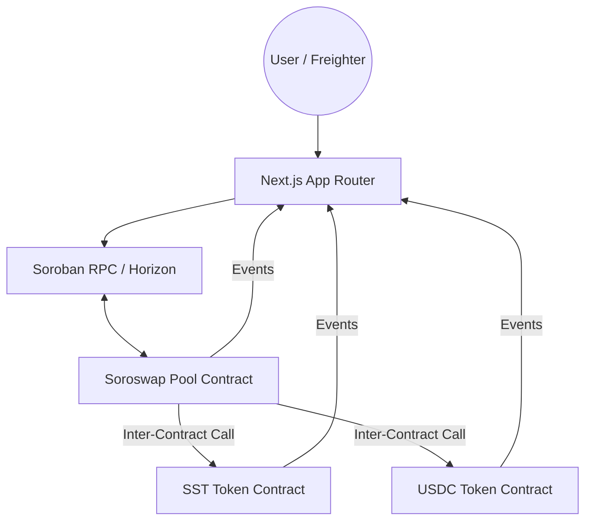

# ⚡ SoroSwap: Production-Grade DeFi on Stellar

[](https://github.com/simmitiwari770-beep/stellar-L-4/actions)


SoroSwap is a production-ready decentralized exchange (DEX) built on Stellar using Soroban smart contracts. It features a custom token implementation with transfer fees and a constant-product liquidity pool (x*y=k) that demonstrates advanced smart contract composability.

## 🎯 Key Features

-   **🔗 Inter-Contract Composability**: The Liquidity Pool contract performs real-time calls to the Token contract for all transfers.
-   **🪙 Advanced Tokenomics**: Custom Soroban token with a 0.3% transfer fee and admin-only minting.
-   **💧 Liquidity Provisioning**: Users can add/remove liquidity and earn 0.3% swap fees.
-   **🔄 Atomic Swaps**: Instant, atomic token swaps with slippage protection and real-time price impact calculations.
-   **🔐 Freighter Integration**: Secure transaction signing using the Freighter browser wallet.
-   **⚡ Live Event Streaming**: Real-time UI updates by listening to on-chain Soroban events.

## 🏗️ Architecture



## 🚀 Getting Started

### Prerequisites

-   [Rust & Cargo](https://rustup.rs/) (v1.94+)
-   [Stellar CLI](https://developers.stellar.org/docs/smart-contracts/getting-started/setup#install-the-stellar-cli)
-   [Node.js](https://nodejs.org/) (v20+)
-   [Freighter Wallet](https://www.freighter.app/)

### Smart Contract Setup

1.  **Build Contracts**:
    ```bash
    cargo build --release --target wasm32-unknown-unknown
    ```
2.  **Run Tests**:
    ```bash
    cargo test --all
    ```
3.  **Deploy to Testnet**:
    ```bash
    # Set your identity
    export SOROBAN_IDENTITY=my_identity
    bash scripts/deploy.sh
    ```

### Frontend Setup

1.  **Install Dependencies**:
    ```bash
    cd frontend
    npm install
    ```
2.  **Configure Environment**:
    Check `frontend/.env.local` (automatically updated by `deploy.sh`).
3.  **Run Development Server**:
    ```bash
    npm run dev
    ```

## 📜 Contract Addresses (Testnet)

| Contract | Address | Explorer |
| :--- | :--- | :--- |
| **SoroSwap Token (SST)** | `C...` | [View on Explorer](https://stellar.expert/explorer/testnet/contract/C...) |
| **Liquidity Pool** | `C...` | [View on Explorer](https://stellar.expert/explorer/testnet/contract/C...) |

## 🧪 Testing

### Contract Unit Tests
The workspace includes comprehensive tests for:
-   Token minting, transfers, and fee logic.
-   Pool liquidity addition/removal logic.
-   Swap price calculation accuracy.

```bash
cargo test
```

### Frontend Integration
-   Simulated contract interaction via `useContracts` hook.
-   Event streaming validation via `useEventStream` hook.

## ⚙️ CI/CD Pipeline
The project uses GitHub Actions for:
-   **Rust Quality**: Automatic compilation, linting, and unit testing of smart contracts.
-   **Frontend Excellence**: TypeScript type-checking, ESLint validation, and Vitest execution.
-   **Seamless Deployment**:
    -   **Contracts**: Automatic deployment to Stellar Testnet on push to `main`.
    -   **Frontend**: Handled by Vercel via automatic branch integration (configured in `vercel.json`).

---

Built with ❤️ on Stellar Soroban.
