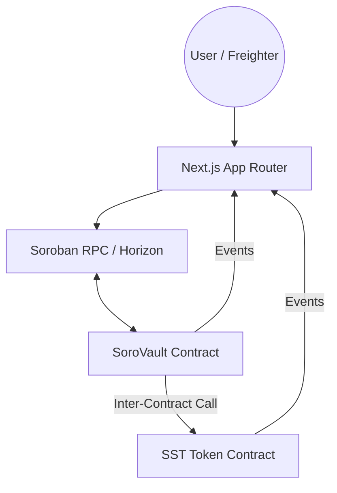

# ⚡ SoroVault: Production-Grade Vault on Stellar

SoroVault is a production decentralized Vault dApp built on Stellar using Soroban smart contracts. It features a custom token implementation and a time-based reward vault (deposits, withdraws, time-accrued rewards) demonstrating advanced smart contract composability.

## 🎯 Key Features

- **🔗 Inter-Contract Composability**: The Vault contract performs real-time calls to the Token contract for all deposits and withdrawals.
- **🪙 Custom Token**: Soroban token with custom minting.
- **🏦 Vault Rewards**: Users can deposit tokens to earn time-based rewards.
- **🔐 Wallet Integration**: Secure transaction signing using the Freighter browser wallet.
- **⚡ Live Event Streaming**: Real-time UI updates by listening to on-chain Soroban events from the RPC.

## 🏗️ Architecture

## 🚀 Live Demo & Proofs

- **Live DApp**: [https://sorovault-defi.vercel.app](https://sorovault-defi.vercel.app)
- **Token Contract (SST)**: `CONTRACT_ADDRESS_HERE`
- **Vault Contract**: `CONTRACT_ADDRESS_HERE`

### 🔗 Inter-Contract Call Proof
When a user deposits tokens, the Vault contract invokes `transfer_from` on the Token contract. 
- **Proof TX**: `TX_HASH_HERE`
- **Logic**: The transaction trace shows the Vault contract calling the token methods atomically.

## 📱 Mobile Experience
The platform is fully optimized for mobile devices, ensuring a seamless DeFi experience on the go.

| Dashboard | Vault Interface |
| :---: | :---: |
|  |  |

## 🛠️ Local Development

### Prerequisites
- Rust (v1.81+) & Stellar CLI
- Node.js (v20+)
- Freighter Wallet

### Smart Contract Setup
1. **Build**: `cargo build --release --target wasm32-unknown-unknown`
2. **Test**: `cargo test --all`
3. **Deploy**: `bash scripts/deploy.sh` (This automatically updates the frontend env)

### Frontend Setup
1. `cd frontend && npm install`
2. `npm run dev`

## ⚙️ CI/CD Setup

The project uses GitHub Actions for automated testing and deployment. To enable production deployments, you MUST configure the following Secrets in your GitHub repository:

| Secret | Description |
| :--- | :--- |
| **`DEPLOYER_SECRET_KEY`** | Secret key of your Stellar account used for contract deployment (S...). |
| **`VERCEL_TOKEN`** | Your Vercel API token (found in Vercel Settings -> Tokens). |
| **`VERCEL_ORG_ID`** | Your Vercel organization ID. |
| **`VERCEL_PROJECT_ID`** | Your Vercel project ID. |

### Deployment Workflow
1. **Contracts**: Automatically optimized and deployed to Testnet on push to `main`.
2. **Frontend**: Built and deployed to Vercel on push to `main` (if secrets are set).

---
Built with ❤️ for the Stellar Community.
