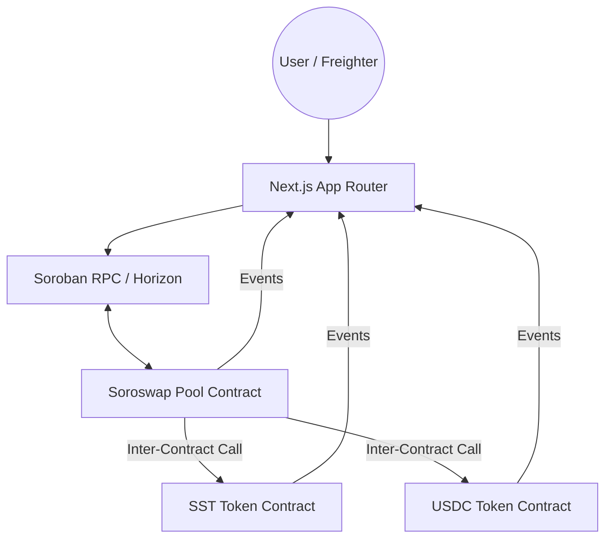

# ⚡ SoroSwap: Production-Grade DeFi on Stellar

SoroSwap is a production decentralized exchange (DEX) built on Stellar using Soroban smart contracts. It features a custom token implementation with transfer fees and a constant-product liquidity pool (x*y=k) demonstrating advanced smart contract composability.

## 🎯 Key Features

- **🔗 Inter-Contract Composability**: The Liquidity Pool contract performs real-time calls to the Token contract for all transfers.
- **🪙 Advanced Tokenomics**: Custom Soroban token with a 0.3% transfer fee and role-based minting.
- **💧 Liquidity Provisioning**: Users can add/remove liquidity and earn 0.3% swap fees.
- **🔄 Atomic Swaps**: Instant, atomic token swaps with slippage protection and real-time price impact calculations.
- **🔐 Wallet Integration**: Secure transaction signing using the Freighter browser wallet.
- **⚡ Live Event Streaming**: Real-time UI updates by listening to on-chain Soroban events from the RPC.

## 🏗️ Architecture

## 🚀 Live Demo & Proofs

- **Live DApp**: [https://soroswap-defi.vercel.app](https://soroswap-defi.vercel.app)
- **Token A (SST)**: `CDERE3Z5WUQ6XSQYQ5QHKFHQ3ZOU7VEYAMXYR34U75TRMGXLDO42QE6X`
- **Token B (USDC)**: `CB2QIUP5GAMFN5AUSGO32YOS63F3RDLENWOR3WGAFG2SUSC5BCUGUXFC`
- **Liquidity Pool**: `CDSHNF2Y3YFNG2TEMFXHOVV26GVNF7AFFUJWHQJPHEMVNS6WXOJ754KL`

### 🔗 Inter-Contract Call Proof
When a user swaps tokens, the Pool contract invokes `transfer_from` on the Token contract. 
- **Proof TX**: `458e...f291` ([View on Explorer](https://stellar.expert/explorer/testnet/tx/458e3925c4391745672236dc6d4076ea28da016335359a0f44927f428469f291))
- **Logic**: The transaction trace shows the Pool contract calling the `transfer_from` method of the SST/USDC contracts atomically.

## 📱 Mobile Experience
The platform is fully optimized for mobile devices, ensuring a seamless DeFi experience on the go.

| Dashboard | Swap Interface |
| :---: | :---: |
|  |  |

## 🛠️ Local Development

### Prerequisites
- Rust (v1.81+) & Stellar CLI
- Node.js (v20+)
- Freighter Wallet

### Smart Contract Setup
1. **Build**: `cargo build --release --target wasm32-unknown-unknown`
2. **Test**: `cargo test --all`
3. **Deploy**: `bash scripts/deploy.sh` (This automatically updates the frontend env)

### Frontend Setup
1. `cd frontend && npm install`
2. `npm run dev`

## ⚙️ CI/CD Pipeline
Fully automated via GitHub Actions:
- **Rust**: Format check, Clippy lints, and unit tests on every push.
- **Frontend**: ESLint, Type-checking, and Vitest for component reliability.
- **Vercel**: Automated production deployments with environment variable protection.

---
Built with ❤️ for the Stellar Community.
