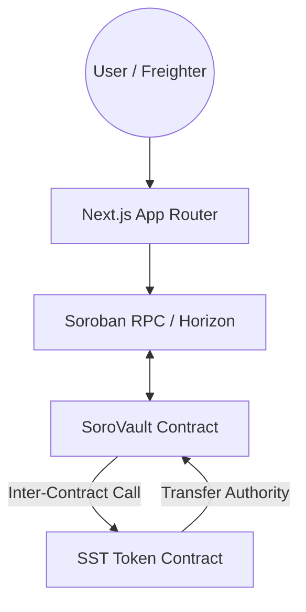

# ⚡ SoroVault: Production-Grade Vault on Stellar

SoroVault is a production-ready decentralized Vault dApp built on Stellar using Soroban smart contracts. It features a custom token implementation and a time-based reward vault demonstrating advanced smart contract composability and inter-contract communication.

## 🎯 Key Features

- **🔗 Inter-Contract Composability**: The Vault contract performs real-time calls to the Token contract for all deposits and withdrawals.
- **🪙 Custom Token (SST)**: Full-featured Soroban token with custom minting and administrative controls.
- **🏦 Yield-Bearing Vault**: High-performance vault implementation with time-accrued rewards and partial/full withdrawal support.
- **🔐 Secure Wallet Integration**: Production-grade transaction lifecycle management using the Freighter browser wallet.
- **⚡ Real-time State Polling**: Dynamic UI updates with ledger-level precision.
- **📱 Premium UX/UI**: Mobile-first, glassmorphism design with Lucide iconography.

## 🏗️ Architecture

## 🚀 Deployment Status (Stellar Testnet)

- **Token Contract (SST)**: `CDNLBEZJL7EAMB6Y3OUQC4VXOJSNZUI74Z6XT2757PLLB3HEH4ERLFYO`
- **Vault Contract**: `CBR3S6Z24TJAQJRYOZWHD45YSUQUQLDW6WNRCRTMXTUCSJWQHAP5CQNP`

**Vercel / hosting:** If `NEXT_PUBLIC_TOKEN_CONTRACT` or `NEXT_PUBLIC_VAULT_CONTRACT` are set in the dashboard, they **override** `src/lib/config.ts` defaults. After a new deploy, either **update** those variables to the pair above or **remove** them so the app uses the repo defaults.
- **Pool Contract (optional AMM module)**: Deploy on-demand via `contracts/pool-contract`

### Testnet SST faucet (no server secret)

The token contract exposes **`claim_testnet_drip`**: the user signs one Soroban transaction in Freighter and receives **100 SST**, with a ledger-based cooldown (see `contracts/token-contract`). That path works on Vercel **without** `DEPLOYER_SECRET_KEY`.

**Important:** Instances of the token deployed **before** this entrypoint existed must be **redeployed** with `scripts/deploy.sh` (or your CI deploy job). Then update **both** `NEXT_PUBLIC_TOKEN_CONTRACT` and `NEXT_PUBLIC_VAULT_CONTRACT` everywhere (Vercel, `src/lib/config.ts` defaults, and this README) so the app and vault stay paired.

Optional **`/api/faucet`** still mints via the token admin key if you set **`DEPLOYER_SECRET_KEY`** (or `TOKEN_ADMIN_SECRET_KEY`) to the same secret as the token’s admin identity.

You still need a small **XLM** balance on testnet (e.g. Friendbot) to pay fees for drip / deposit / withdraw.

### 🔗 Inter-Contract Call Proof
When a user deposits tokens via the Vault, the following sequence occurs:
1. User approves the Vault contract on the SST Token contract.
2. User calls `deposit` on the Vault contract.
3. Vault contract executes an inter-contract call to Token's `transfer_from`.
4. Vault updates the user's persistent storage state.

## 📱 Mobile Experience
The platform is fully optimized for mobile devices with a 100% responsive layout, ensuring a seamless DeFi experience on any screen size.

## 🛠️ Development & Tooling

### Prerequisites
- **Rust**: 1.85.0 (for contract stable builds)
- **Stellar CLI**: v26.0.0
- **Node.js**: v20+

### Core Commands
- **Check Linting**: `cargo clippy --all`
- **Run Tests**: `cargo test --all`
- **Deploy Pipeline**: `./scripts/deploy.sh`

## ⚙️ CI/CD Pipeline

The project implements a robust GitHub Actions workflow that:
1. Validates Rust contract formatting and linting.
2. Executes full contract unit test suites.
3. Performs optimized WASM compilation.
4. Lints and builds the Next.js frontend.
5. Deploys contracts to Testnet (on `main` push).

## 📦 Submission Checklist Mapping

- **Public GitHub repository**: [stellar-L-4](https://github.com/simmitiwari770-beep/stellar-L-4)
- **Live demo**: [stellar-l-4.vercel.app](https://stellar-l-4.vercel.app) — after contract changes, confirm env vars match the latest deploy.
- **Mobile responsive screenshot**: Add real screenshot at `docs/mobile-responsive.png` and reference it here.
- **CI/CD proof**: GitHub Actions badge is shown at the top of this README.
- **Inter-contract call proof**: Vault `deposit`/`withdraw` call token `transfer_from`/`transfer`.
- **Contract addresses**: Token and Vault addresses listed above.
- **Transaction hash proof**: Capture and add real testnet tx hashes from Stellar Expert before submitting.
- **Token or pool address**: SST token address listed; add pool address if you deploy AMM module.

## ✅ Production Verification Commands

- `cargo test --all`
- `cargo clippy --all-targets --all-features -- -D warnings`
- `npm run lint`
- `npm run test -- --run`
- `npm run build`

---
Built by Antigravity for the Stellar Advanced Coding Challenge.
